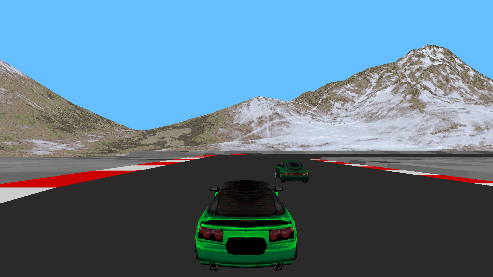

# 🎮 Turbo Rivals

*Racing game writing on C++ and raylib focused on cross-platform, performance, architecture, and gameplay experience.*

---

## 📌 About The Project

This project is a game application developed in **C++23** using the **raylib**, **Bullet3**, **ENet**, **ImGui** libraries.

The project is designed as a cross-platform solution with a focus on clean architecture, scalability, and performance. All required libraries are already included inside the project, so no additional dependency installation is needed — everything builds autonomously.

---

## ✨ Features

- Cross-platform build support
- Fully self-contained project
- Modern C++
- High performance
- Scalable architecture
- Minimalistic stack without heavy engines

---

## 👨‍💻 Creator

**Project Author:** Ras1L

---

# 📥 Installation

## Download The Project

### Using Git

```bash
git clone https://github.com/Ras1L/TurboRivals.git
cd TurboRivals
```

### Or Download ZIP

```text
Code -> Download ZIP
```

After extracting the archive, open the project folder.

---

# ⚙️ Build

## Build Using CMake

```bash
cmake -S . -B build
cmake --build build
```

---

## If CMake Is Not Installed

Download it here:

https://cmake.org/download/

Check installation:

```bash
cmake --version
```

---

# ▶️ Run

After building, the executable file will appear inside:

```text
build/
```

### Windows

```bash
build\src\TurboRivals.exe
```

### Linux / macOS

```bash
./build/src/TurboRivals
```

---

# 🎮 Controls

| Key | Action |
|---|---|
| WASD | Movement |
| SPACE | Action |
| ESC | Exit |

---

# 📸 Screenshots Gameplay

```md

```

# 📄 License

```text
MIT License © 2026
```

---

> This project is developed for educational and research purposes.